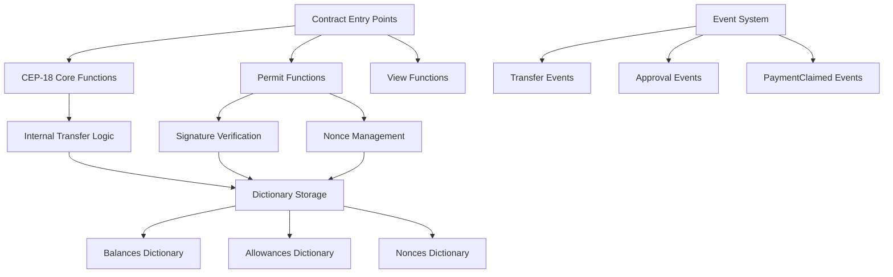

# Design Document

## Overview

The CEP-18 Permit Token Contract is a sophisticated smart contract implementation that extends the standard CEP-18 fungible token specification with EIP-2612/EIP-3009 style permit functionality. This design enables gasless transactions where token holders can authorize transfers through cryptographic signatures, allowing recipients or third parties to pay the gas fees while executing the authorized token transfers.

The contract implements a complete CEP-18 token with additional signature-based payment capabilities, robust nonce management for replay protection, and comprehensive event logging. The design prioritizes security, gas efficiency, and compatibility with existing Casper ecosystem tools.

## Architecture

The contract follows a modular architecture with clear separation of concerns:



The architecture consists of three main layers:
1. **Entry Point Layer**: Handles external contract calls and parameter validation
2. **Business Logic Layer**: Implements token operations, signature verification, and nonce management
3. **Storage Layer**: Manages persistent state through Casper's dictionary storage system

## Components and Interfaces

### Core Token Components

**Token Metadata Manager**
- Stores and retrieves token name, symbol, decimals, and total supply
- Provides read-only access to token metadata
- Implements standard CEP-18 metadata functions

**Balance Manager**
- Manages account balances using dictionary storage
- Provides efficient balance queries and updates
- Handles balance validation for transfers

**Allowance Manager**
- Manages spending allowances between accounts
- Implements approve/transfer_from pattern
- Provides allowance queries and updates

### Permit System Components

**Signature Verifier**
- Reconstructs signed messages using standardized format
- Verifies cryptographic signatures against public keys
- Handles different signature types (Ed25519, Secp256k1)

**Nonce Manager**
- Tracks nonces for each account to prevent replay attacks
- Provides nonce queries and atomic increment operations
- Ensures sequential nonce usage

**Message Constructor**
- Builds standardized message payloads for signing
- Includes Casper Wallet compatibility prefix
- Formats messages with chain name, contract hash, and payment details

### Event System

**Event Emitter**
- Emits standardized events for all state changes
- Provides structured event data for external monitoring
- Supports Transfer, Approval, and PaymentClaimed events

## Data Models

### Token Metadata
```rust
struct TokenMetadata {
    name: String,        // Token name (e.g., "My Token")
    symbol: String,      // Token symbol (e.g., "MTK")
    decimals: u8,        // Decimal places (e.g., 18)
    total_supply: U256,  // Total token supply
}
```

### Account State
```rust
struct AccountState {
    balance: U256,       // Token balance
    nonce: u64,         // Current nonce for signature verification
}
```

### Allowance Record
```rust
struct AllowanceRecord {
    owner: AccountHash,    // Token owner
    spender: AccountHash,  // Authorized spender
    amount: U256,         // Allowed amount
}
```

### Payment Authorization
```rust
struct PaymentAuth {
    user_pubkey: PublicKey,  // Authorizing user's public key
    recipient: AccountHash,   // Payment recipient
    amount: U256,            // Payment amount
    nonce: u64,             // Anti-replay nonce
    deadline: u64,          // Expiration timestamp
    signature: String,      // Hex-encoded signature
}
```

### Storage Schema

The contract uses Casper's dictionary storage for efficient key-value operations:

- **Balances Dictionary**: `account_hash -> U256`
- **Allowances Dictionary**: `"owner_spender" -> U256`
- **Nonces Dictionary**: `account_hash -> u64`
- **Metadata Storage**: Direct URef storage for token metadata

## Data Models

### Message Format for Signatures

The contract uses a standardized message format for signature verification:

```
Format: "Casper Message:\nx402-casper:<chain_name>:<contract_hash>:<recipient>:<amount>:<nonce>:<deadline>"
```

This format ensures compatibility with Casper Wallet and provides clear structure for signature verification.

## Correctness Properties

*A property is a characteristic or behavior that should hold true across all valid executions of a system-essentially, a formal statement about what the system should do. Properties serve as the bridge between human-readable specifications and machine-verifiable correctness guarantees.*

### Token Initialization and Metadata Properties

**Property 1: Token initialization consistency**
*For any* valid token parameters (name, symbol, decimals, total_supply), initializing the contract should result in metadata queries returning exactly those same values
**Validates: Requirements 1.1, 1.2**

**Property 2: Initial supply allocation**
*For any* total supply amount, after contract deployment the deployer's balance should equal the total supply and no other accounts should have balances
**Validates: Requirements 1.4**

**Property 3: Balance query accuracy**
*For any* account and any balance amount set in storage, querying that account's balance should return exactly the stored amount
**Validates: Requirements 1.3**

### Transfer and Allowance Properties

**Property 4: Transfer balance conservation**
*For any* valid transfer between different accounts, the sum of all account balances should remain constant before and after the transfer
**Validates: Requirements 1.5, 2.1**

**Property 5: Transfer insufficient balance rejection**
*For any* transfer attempt where the sender's balance is less than the transfer amount, the transaction should revert with insufficient balance error
**Validates: Requirements 2.5**

**Property 6: Allowance round-trip consistency**
*For any* owner-spender pair and allowance amount, setting an allowance then querying it should return exactly the same amount
**Validates: Requirements 2.2, 2.3**

**Property 7: Transfer_from allowance deduction**
*For any* successful transfer_from operation, the allowance should decrease by exactly the transfer amount
**Validates: Requirements 2.4**

**Property 8: Transfer_from insufficient allowance rejection**
*For any* transfer_from attempt where the allowance is less than the transfer amount, the transaction should revert with insufficient allowance error
**Validates: Requirements 2.5**

### Signature and Permit Properties

**Property 9: Message format consistency**
*For any* payment authorization parameters, the constructed message should follow the exact format: "Casper Message:\nx402-casper:<chain_name>:<contract_hash>:<recipient>:<amount>:<nonce>:<deadline>"
**Validates: Requirements 3.1**

**Property 10: Valid signature acceptance**
*For any* correctly signed payment authorization with valid parameters, the claim_payment function should successfully execute the transfer
**Validates: Requirements 3.2**

**Property 11: Invalid signature rejection**
*For any* payment authorization with an invalid signature, the claim_payment function should revert with invalid signature error
**Validates: Requirements 3.4**

**Property 12: Expired payment rejection**
*For any* payment authorization where the deadline is less than the current block timestamp, the claim_payment function should revert with expired error
**Validates: Requirements 3.5**

### Nonce Management Properties

**Property 13: Nonce query accuracy**
*For any* account, querying the nonce should return the current nonce value stored for that account
**Validates: Requirements 4.1**

**Property 14: Nonce validation requirement**
*For any* signature-based payment, the provided nonce must exactly match the current account nonce or the transaction should revert
**Validates: Requirements 4.2, 4.4**

**Property 15: Nonce increment consistency**
*For any* successful signature-based payment, the account nonce should increase by exactly one
**Validates: Requirements 4.3**

**Property 16: Replay attack prevention**
*For any* signature-based payment that has been successfully executed, attempting to execute it again should fail due to nonce mismatch
**Validates: Requirements 4.5**

### Event Emission Properties

**Property 17: Transfer event completeness**
*For any* successful token transfer, a Transfer event should be emitted with correct from, to, and amount parameters
**Validates: Requirements 5.1**

**Property 18: Approval event completeness**
*For any* successful allowance setting, an Approval event should be emitted with correct owner, spender, and amount parameters
**Validates: Requirements 5.2**

**Property 19: PaymentClaimed event completeness**
*For any* successful signature-based payment, a PaymentClaimed event should be emitted with correct user, recipient, amount, and nonce parameters
**Validates: Requirements 5.3**

### Error Handling Properties

**Property 20: Error code consistency**
*For any* specific error condition (insufficient balance, insufficient allowance, invalid nonce, invalid signature, expired), the contract should always revert with the same specific error code
**Validates: Requirements 5.4**

**Property 21: State persistence guarantee**
*For any* successful contract operation, all state changes should be properly persisted and queryable in subsequent operations
**Validates: Requirements 5.5**

## Error Handling

The contract implements comprehensive error handling with specific error codes for different failure conditions:

- **ERROR_INSUFFICIENT_BALANCE (100)**: Thrown when attempting transfers with insufficient token balance
- **ERROR_INSUFFICIENT_ALLOWANCE (101)**: Thrown when attempting transfer_from with insufficient allowance
- **ERROR_INVALID_NONCE (200)**: Thrown when signature-based payment uses incorrect nonce
- **ERROR_INVALID_SIGNATURE (201)**: Thrown when signature verification fails
- **ERROR_EXPIRED (202)**: Thrown when signature-based payment deadline has passed
- **ERROR_ZERO_ADDRESS (203)**: Reserved for zero address validation (if implemented)

All errors use Casper's `ApiError::User` mechanism to provide clear, distinguishable error codes that can be handled appropriately by calling applications.

## Testing Strategy

The testing strategy employs a dual approach combining unit tests for specific scenarios and property-based tests for comprehensive validation across all possible inputs.

### Unit Testing Approach

Unit tests will cover:
- Contract deployment and initialization with specific parameter sets
- Basic token operations (transfer, approve, transfer_from) with known values
- Error conditions with specific invalid inputs
- Event emission verification for known scenarios
- Integration between different contract functions

### Property-Based Testing Approach

Property-based testing will use **Hypothesis** (Python) for comprehensive validation of the correctness properties defined above. Each property-based test will:
- Run a minimum of 100 iterations with randomly generated inputs
- Test universal properties that should hold across all valid executions
- Validate invariants and round-trip properties
- Verify error handling across all invalid input combinations

**Property-Based Testing Configuration:**
- Testing Framework: Hypothesis (Python)
- Minimum Iterations: 100 per property test
- Test Tagging: Each property test will be tagged with the format: `**Feature: cep18-permit-token, Property {number}: {property_text}**`

**Key Testing Patterns:**
1. **Invariant Testing**: Balance conservation, total supply consistency
2. **Round-Trip Testing**: Metadata storage/retrieval, allowance setting/querying
3. **Error Condition Testing**: Invalid inputs should always produce appropriate errors
4. **State Transition Testing**: Operations should correctly transition contract state
5. **Event Emission Testing**: All state changes should emit appropriate events

The combination of unit and property-based testing ensures both concrete functionality validation and comprehensive coverage of the contract's behavior space, providing high confidence in the contract's correctness and security.