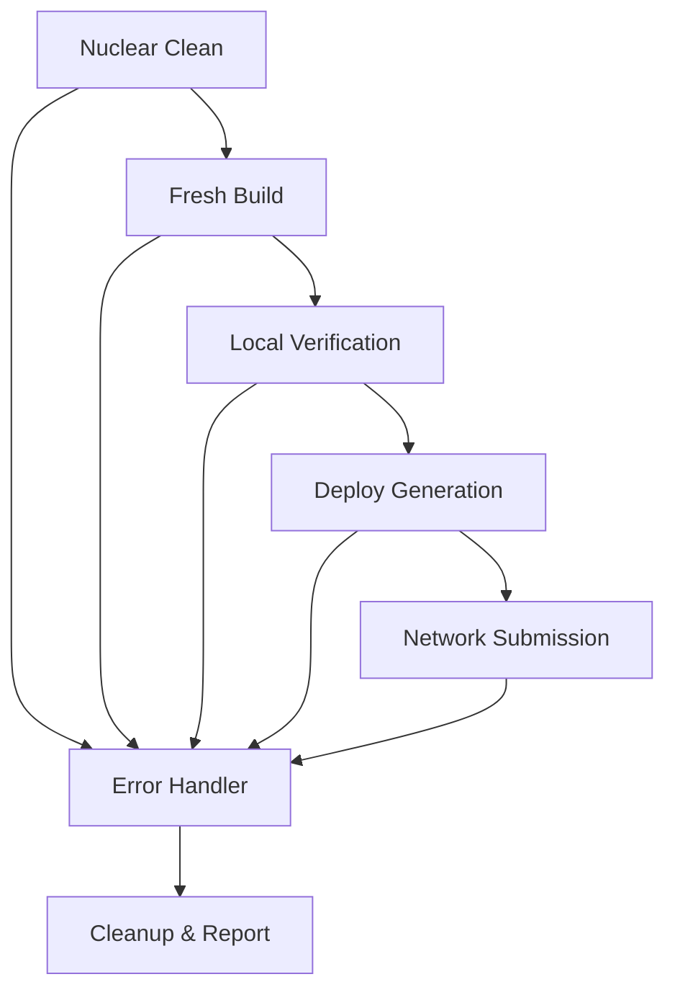

# Nuclear Contract Deployment Design Document

## Overview

The Nuclear Contract Deployment system provides a comprehensive solution for resolving persistent "Missing Argument" errors in Casper smart contract deployments. The system implements a clean-build-test-deploy pipeline that eliminates stale WASM artifacts and ensures successful contract deployment through automated verification and retry mechanisms.

The design follows a sequential workflow pattern where each phase must complete successfully before proceeding to the next, with comprehensive error handling and rollback capabilities at each stage.

## Architecture

The system is structured as a modular pipeline with five distinct phases:

```
Nuclear Clean → Fresh Build → Local Verification → Deploy Generation → Network Submission
```

Each phase is implemented as an independent module with clear input/output contracts, enabling isolated testing and debugging. The system uses Python for orchestration due to its excellent subprocess management and HTTP client capabilities.

### Component Interaction Flow



## Components and Interfaces

### 1. Nuclear Clean Module
**Purpose**: Eliminates all build artifacts to prevent stale binary issues

**Interface**:
```python
def nuclear_clean() -> CleanResult:
    """
    Forcibly removes target/ and wasm/ directories
    Returns: CleanResult with success status and removed paths
    """
```

**Implementation Strategy**:
- Uses `shutil.rmtree()` with `ignore_errors=False` for complete removal
- Verifies directory deletion through `os.path.exists()` checks
- Handles permission errors on Windows/macOS through elevated removal

### 2. Fresh Build Module
**Purpose**: Compiles contract with Odra framework and detects output artifacts

**Interface**:
```python
def fresh_build() -> BuildResult:
    """
    Executes cargo odra build and detects generated WASM
    Returns: BuildResult with WASM path and build metadata
    """
```

**Implementation Strategy**:
- Executes `cargo odra build -b casper` via subprocess
- Scans `wasm/` directory for `.wasm` files using glob patterns
- Selects most recent file by modification time if multiple exist
- Captures build output for error diagnosis

### 3. Local Verification Module
**Purpose**: Validates contract logic through Odra testing framework

**Interface**:
```python
def local_verification() -> VerificationResult:
    """
    Creates and runs test_deploy_no_args test
    Returns: VerificationResult with test outcomes
    """
```

**Implementation Strategy**:
- Generates test code in `src/lib.rs` or dedicated test file
- Uses Odra's `TestEnv` for isolated contract testing
- Executes `cargo odra test` and parses output for pass/fail status
- Preserves existing tests while adding verification test

### 4. Deploy Generation Module
**Purpose**: Creates signed deployment transactions for network submission

**Interface**:
```python
def generate_deploy(wasm_path: str) -> DeployResult:
    """
    Creates signed deploy using casper-client
    Returns: DeployResult with deploy JSON and metadata
    """
```

**Implementation Strategy**:
- Uses `casper-client make-deploy` with detected WASM file
- Targets `casper-test` network with appropriate gas settings
- Signs with private key from `keys/secret_key.pem`
- Outputs deploy JSON to `deploy_final.json`

### 5. Network Submission Module
**Purpose**: Submits deployment to Casper testnet with retry logic

**Interface**:
```python
def submit_deploy(deploy_json: str) -> SubmissionResult:
    """
    Submits deploy to testnet with retry logic
    Returns: SubmissionResult with deploy hash or error
    """
```

**Implementation Strategy**:
- Uses `urllib` with SSL context for HTTPS requests
- Includes API key authentication in headers
- Implements exponential backoff for timestamp errors
- Parses RPC responses for deploy hash extraction

## Data Models

### Result Types
```python
@dataclass
class CleanResult:
    success: bool
    removed_paths: List[str]
    error_message: Optional[str] = None

@dataclass
class BuildResult:
    success: bool
    wasm_path: Optional[str] = None
    build_output: str = ""
    error_message: Optional[str] = None

@dataclass
class VerificationResult:
    success: bool
    test_output: str = ""
    failed_tests: List[str] = field(default_factory=list)
    error_message: Optional[str] = None

@dataclass
class DeployResult:
    success: bool
    deploy_json_path: Optional[str] = None
    deploy_hash: Optional[str] = None
    error_message: Optional[str] = None

@dataclass
class SubmissionResult:
    success: bool
    deploy_hash: Optional[str] = None
    retry_count: int = 0
    error_message: Optional[str] = None
```

### Configuration Model
```python
@dataclass
class DeploymentConfig:
    network: str = "casper-test"
    rpc_url: str = "https://node.testnet.cspr.cloud/rpc"
    api_key: str = "019b2b7d-e2ba-752e-a21d-81383b1fd6fe"
    private_key_path: str = "keys/secret_key.pem"
    max_retries: int = 3
    retry_delay: int = 5
```

## Correctness Properties

*A property is a characteristic or behavior that should hold true across all valid executions of a system-essentially, a formal statement about what the system should do. Properties serve as the bridge between human-readable specifications and machine-verifiable correctness guarantees.*

### Property Reflection

After analyzing the acceptance criteria, I identified several potential properties but found significant redundancy:

- Multiple properties tested directory deletion in different ways
- Several properties validated the same build success conditions
- Network submission properties overlapped with retry logic properties

The reflection process eliminated redundant properties and consolidated related validations into comprehensive properties that provide unique validation value.

**Property 1: Nuclear clean completeness**
*For any* deployment workflow execution, after the nuclear clean phase completes successfully, both target and wasm directories should not exist on the filesystem
**Validates: Requirements 1.1, 1.2, 1.3**

**Property 2: Build artifact consistency**
*For any* successful build execution, the generated WASM file should be newer than the build start time and should be the only WASM file in the wasm directory after a clean build
**Validates: Requirements 2.2, 2.3, 2.5**

**Property 3: Local verification round trip**
*For any* contract that passes local verification tests, deploying the contract through the test environment and then querying its state should return the expected initial values
**Validates: Requirements 3.2, 3.3**

**Property 4: Deploy generation determinism**
*For any* given WASM file and configuration, generating a deploy multiple times with the same parameters should produce identical deployment JSON (excluding timestamp fields)
**Validates: Requirements 5.2, 5.3, 5.5**

**Property 5: Network submission idempotency**
*For any* valid signed deploy JSON, submitting it multiple times to the network should either succeed with the same deploy hash or fail with a duplicate transaction error
**Validates: Requirements 6.2, 6.4**

**Property 6: Retry logic convergence**
*For any* timestamp-related error, the retry mechanism should eventually succeed within the maximum retry limit when the timestamp issue resolves
**Validates: Requirements 7.1, 7.2, 7.3**

**Property 7: Workflow atomicity**
*For any* nuclear deployment execution, if any phase fails, the system should be in a clean state where the workflow can be restarted without conflicts
**Validates: Requirements 8.2, 8.4**

## Error Handling

The system implements comprehensive error handling with specific strategies for each failure mode:

### Build Errors
- **Compilation Failures**: Capture stderr from cargo and present formatted error messages
- **Missing Dependencies**: Detect and report missing Odra framework or Rust toolchain
- **Permission Issues**: Handle file system permission errors with elevated access suggestions

### Network Errors
- **Connection Failures**: Retry with exponential backoff for transient network issues
- **Authentication Errors**: Validate API key format and provide clear authentication guidance
- **Timestamp Errors**: Implement specific retry logic with 5-second delays
- **Rate Limiting**: Detect 429 responses and implement appropriate backoff

### File System Errors
- **Directory Removal**: Handle locked files and provide manual cleanup instructions
- **WASM Detection**: Gracefully handle missing or multiple WASM files
- **Key File Access**: Validate private key file existence and format

### Rollback Strategy
Each phase maintains rollback capabilities:
- **Clean Phase**: No rollback needed (destructive by design)
- **Build Phase**: Automatic cleanup on failure
- **Test Phase**: Restore original test files if modified
- **Deploy Phase**: Remove generated deploy files on failure
- **Submit Phase**: No rollback needed (network state is immutable)

## Testing Strategy

The testing approach combines unit testing for individual components with property-based testing for workflow validation.

### Unit Testing Approach
Unit tests focus on:
- Individual module functionality with mocked dependencies
- Error condition handling and edge cases
- Configuration validation and parsing
- File system operation verification

### Property-Based Testing Approach
Property tests verify universal behaviors using the Hypothesis library for Python:
- Generate random valid configurations and verify workflow consistency
- Test with various file system states and permissions
- Validate network retry logic with simulated failures
- Verify cleanup behavior across different error scenarios

**Property-Based Testing Configuration**:
- Library: Hypothesis for Python
- Minimum iterations: 100 per property test
- Each property test tagged with: **Feature: nuclear-contract-deployment, Property {number}: {property_text}**
- Property tests run as part of the standard test suite

### Integration Testing
- End-to-end workflow testing with real Odra projects
- Network integration testing with Casper testnet
- Cross-platform testing (macOS, Linux, Windows)
- Performance testing for large contract builds

### Test Data Management
- Use temporary directories for isolated testing
- Mock network responses for reliable unit testing
- Provide sample contracts for integration testing
- Maintain test key pairs separate from production keys