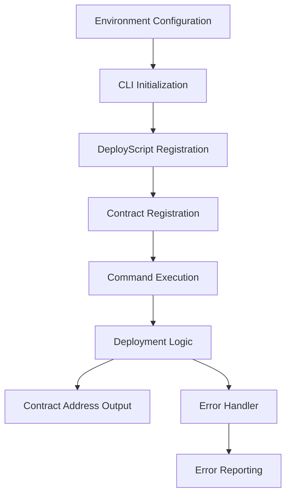

# Odra CLI Deployment Design Document

## Overview

The Odra CLI Deployment system provides a streamlined, Rust-native approach for deploying the Flipper smart contract to the Casper casper-custom. The system leverages the existing Odra CLI framework to create a deployment script that follows the established DeployScript pattern, ensuring idempotent deployments with proper error handling and environment configuration.

The design builds upon the existing CLI infrastructure in the project, extending it with proper environment configuration and deployment commands while maintaining compatibility with the current Odra framework setup.

## Architecture

The system follows the Odra CLI framework's established patterns with three main components:

```
Environment Configuration → CLI Entry Point → Deployment Script Execution
```

The architecture leverages Rust's type system and the Odra framework's built-in deployment mechanisms to provide a robust, idempotent deployment solution.

### Component Interaction Flow



## Components and Interfaces

### 1. Environment Configuration Module
**Purpose**: Manages Casper casper-custom connection parameters and authentication

**Interface**:
```rust
// Environment variables loaded by Odra CLI
ODRA_CASPER_NODE_ADDRESS: String
ODRA_CASPER_CHAIN_NAME: String  
ODRA_CASPER_SECRET_KEY_PATH: String
```

**Implementation Strategy**:
- Uses `.env` file in project root for configuration
- Leverages Odra CLI's built-in environment variable loading
- Provides sensible defaults for Casper casper-custom deployment

### 2. CLI Entry Point Module
**Purpose**: Initializes and configures the Odra CLI framework

**Interface**:
```rust
pub fn main() {
    OdraCli::new()
        .about("CLI tool for Flipper contract deployment")
        .deploy(DeployFlipperScript)
        .contract::<Flipper>()
        .run();
}
```

**Implementation Strategy**:
- Extends existing `bin/cli.rs` or creates new `bin/odra-cli.rs`
- Registers deployment script and contract type
- Provides command-line interface for deployment operations

### 3. Deployment Script Module
**Purpose**: Implements the DeployScript trait for Flipper contract deployment

**Interface**:
```rust
pub struct DeployFlipperScript;

impl DeployScript for DeployFlipperScript {
    fn deploy(
        &self,
        env: &HostEnv,
        container: &mut DeployedContractsContainer
    ) -> Result<(), odra_cli::deploy::Error>;
}
```

**Implementation Strategy**:
- Uses `Flipper::load_or_deploy` for idempotent deployment
- Configures appropriate gas limits (350 CSPR)
- Handles initialization with `NoArgs` (since Flipper uses default initialization)
- Logs deployment results with contract address

### 4. Contract Integration Module
**Purpose**: Ensures proper integration between Flipper contract and CLI framework

**Interface**:
```rust
// Flipper contract already implements required traits
impl Deployer<NoArgs> for Flipper { ... }
impl ContractProvider for Flipper { ... }
```

**Implementation Strategy**:
- Leverages existing Flipper contract implementation
- Uses `NoArgs` for initialization (matches contract's `init()` method)
- Ensures compatibility with Odra CLI's container system

## Data Models

### Configuration Model
```rust
// Environment configuration (loaded from .env)
pub struct CasperConfig {
    pub node_address: String,      // "http://65.21.227.180:7777"
    pub chain_name: String,        // "casper-custom"
    pub secret_key_path: String,   // "keys/secret_key.pem"
}
```

### Deployment Result Model
```rust
// Built into Odra CLI framework
pub struct DeploymentResult {
    pub contract_address: String,
    pub deploy_hash: String,
    pub gas_used: u64,
}
```

### Error Model
```rust
// Leverages existing Odra CLI error types
pub enum DeploymentError {
    NetworkError(String),
    ConfigurationError(String),
    ContractError(String),
    GasError(String),
}
```

## Correctness Properties

*A property is a characteristic or behavior that should hold true across all valid executions of a system-essentially, a formal statement about what the system should do. Properties serve as the bridge between human-readable specifications and machine-verifiable correctness guarantees.*
### Property Reflection

After analyzing the acceptance criteria, I identified several properties but found some redundancy:

- Multiple properties tested CLI configuration in similar ways
- Several properties validated the same deployment behavior from different angles  
- Error handling properties overlapped with specific error scenarios

The reflection process consolidated related validations into comprehensive properties that provide unique validation value while eliminating redundancy.

**Property 1: CLI command handling consistency**
*For any* valid command line arguments provided to the Odra CLI, the system should parse and execute the appropriate deployment logic without errors
**Validates: Requirements 4.5**

**Property 2: Environment configuration validation**
*For any* set of environment variables, the system should validate all required variables are properly formatted before attempting deployment
**Validates: Requirements 5.5**

**Property 3: Network connectivity verification**
*For any* deployment execution, the system should attempt to connect to the configured Casper casper-custom endpoint using the provided configuration
**Validates: Requirements 6.3**

**Property 4: Successful deployment address consistency**
*For any* successful deployment, the system should return a valid contract address that can be used for subsequent contract interactions
**Validates: Requirements 6.4**

**Property 5: Deployment failure error reporting**
*For any* deployment failure scenario, the system should provide clear error messages that indicate the specific failure reason
**Validates: Requirements 6.5**

**Property 6: Container existence checking**
*For any* deployment attempt, the load_or_deploy method should check if a contract instance already exists in the container before proceeding
**Validates: Requirements 7.1**

**Property 7: Idempotent deployment behavior**
*For any* deployment configuration, executing the deployment multiple times should return the same contract address without creating duplicate contracts
**Validates: Requirements 7.2, 7.4**

**Property 8: Initial deployment creation**
*For any* clean container state, the first deployment should create a new contract instance and return a valid address
**Validates: Requirements 7.3**

**Property 9: Deployment status logging**
*For any* deployment result, the system should log whether the contract was newly deployed or loaded from an existing deployment
**Validates: Requirements 7.5**

**Property 10: Error propagation consistency**
*For any* deployment operation that fails, the system should propagate errors using the Result type with descriptive error messages
**Validates: Requirements 8.1**

**Property 11: Configuration validation precedence**
*For any* invalid environment configuration, the system should report configuration errors before attempting any network operations
**Validates: Requirements 8.2**

**Property 12: Network error messaging**
*For any* network connectivity failure, the system should provide clear network-related error messages that help diagnose the issue
**Validates: Requirements 8.3**

**Property 13: Error recovery safety**
*For any* error state during deployment, retrying the deployment process should not cause side effects or inconsistent state
**Validates: Requirements 8.5**

## Error Handling

The system implements comprehensive error handling leveraging Rust's Result type system and the Odra CLI framework's built-in error handling mechanisms:

### Configuration Errors
- **Missing Environment Variables**: Validate all required environment variables are present before deployment
- **Invalid Network Configuration**: Check network endpoint accessibility and format
- **Missing Secret Key**: Verify secret key file exists and is readable
- **Invalid Gas Limits**: Validate gas limit values are within acceptable ranges

### Deployment Errors
- **Contract Compilation Failures**: Capture and report Rust compilation errors
- **Network Connection Issues**: Handle network timeouts and connectivity problems
- **Insufficient Gas**: Detect and report gas-related deployment failures
- **Authentication Failures**: Handle invalid secret key or permission issues

### Runtime Errors
- **Container State Issues**: Handle corrupted or inconsistent container state
- **File System Errors**: Manage file access and permission problems
- **Memory Issues**: Handle out-of-memory conditions during deployment

### Error Recovery Strategy
- **Idempotent Operations**: All deployment operations can be safely retried
- **State Validation**: Verify system state before and after operations
- **Graceful Degradation**: Provide fallback options when possible
- **Clear Error Messages**: Include actionable information in all error messages

## Testing Strategy

The testing approach combines unit testing for individual components with property-based testing for deployment behavior validation.

### Unit Testing Approach
Unit tests focus on:
- CLI configuration and argument parsing
- Environment variable loading and validation
- DeployScript trait implementation
- Error condition handling and messaging
- File system operations (directory creation, .env file generation)

### Property-Based Testing Approach
Property tests verify universal behaviors using the Proptest library for Rust:
- Generate random valid configurations and verify deployment consistency
- Test with various command line argument combinations
- Validate idempotent behavior across multiple deployment attempts
- Verify error handling with simulated failure conditions

**Property-Based Testing Configuration**:
- Library: Proptest for Rust
- Minimum iterations: 100 per property test
- Each property test tagged with: **Feature: odra-cli-deployment, Property {number}: {property_text}**
- Property tests run as part of the standard test suite using `cargo test`

### Integration Testing
- End-to-end deployment testing with real Casper casper-custom
- CLI command execution testing with various argument combinations
- Environment configuration testing with different .env file states
- Cross-platform testing (macOS, Linux, Windows)

### Test Data Management
- Use temporary directories for isolated testing
- Mock network responses for reliable unit testing
- Provide sample environment configurations for testing
- Maintain separate test keys for development testing

### Testing Dependencies
```toml
[dev-dependencies]
proptest = "1.0"
tempfile = "3.0"
mockall = "0.11"
```

The testing strategy ensures comprehensive coverage of both happy path scenarios and error conditions while maintaining fast test execution and reliable results.