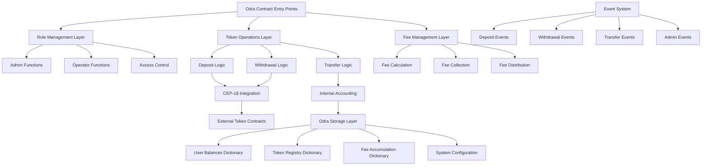

# Design Document

## Overview

The Odra Vault Facilitator is a sophisticated smart contract system built on the Casper blockchain using the Odra framework. It provides vault-based token accounting functionality similar to Solana Foundation's Kora, enabling secure deposit, withdrawal, and transfer operations with comprehensive fee management, role-based access control, and administrative oversight.

The system acts as a custodial vault that holds various CEP-18 tokens on behalf of users while maintaining internal accounting balances. Users can deposit tokens into the vault, transfer tokens to other users within the vault system (without external blockchain transactions), and withdraw tokens back to their external accounts. The design prioritizes security, gas efficiency, and regulatory compliance through comprehensive limits and controls.

## Architecture

The contract follows a modular architecture with clear separation of concerns and leverages Odra's built-in patterns for storage, events, and cross-contract calls:



The architecture consists of four main layers:
1. **Entry Point Layer**: Handles external contract calls using Odra's contract framework
2. **Business Logic Layer**: Implements vault operations, role management, and fee processing
3. **Integration Layer**: Manages CEP-18 token interactions and internal accounting
4. **Storage Layer**: Utilizes Odra's dictionary storage for efficient state management

## Components and Interfaces

### Core Vault Components

**Token Registry Manager**
- Maintains a registry of supported CEP-18 tokens with their contract hashes
- Validates token compliance with CEP-18 standard
- Provides token lookup and validation services
- Uses Odra's `Mapping` for efficient token hash storage

**Balance Manager**
- Manages user balances for each supported token using composite keys
- Implements efficient balance queries and atomic updates
- Handles balance validation for all operations
- Uses Odra's `Mapping<(Address, ContractHash), U256>` for user balances

**Vault Operations Engine**
- Orchestrates deposit, withdrawal, and transfer operations
- Integrates with external CEP-18 contracts for token movements
- Manages internal balance accounting and fee deduction
- Ensures atomic operations and proper error handling

### Role Management Components

**Admin Controller**
- Manages system-wide administrative functions
- Controls fee rates, system pause state, and operator assignments
- Handles admin role transfers and system configuration
- Implements single admin pattern with transfer capability

**Operator Manager**
- Manages operator role assignments and permissions
- Provides limited administrative functions for day-to-day operations
- Handles user limit management and whitelist/blacklist operations
- Supports multiple operators with specific permission scopes

**Access Control System**
- Validates caller permissions for all restricted operations
- Implements role-based access control with clear hierarchies
- Provides consistent authorization checks across all functions
- Uses Odra's caller identification for permission validation

### Fee Management Components

**Fee Calculator**
- Calculates fees using basis points (BPS) with proper precision
- Supports different fee rates for deposit, withdrawal, and transfer operations
- Handles fee rounding and minimum fee enforcement
- Ensures accurate fee computation across all token decimals

**Fee Collector**
- Accumulates fees in designated collection accounts per token
- Tracks fee collection separately for each supported token
- Provides fee withdrawal functionality for administrators
- Maintains audit trail of all fee operations

### Security and Limits Components

**Limit Enforcer**
- Enforces per-user deposit and balance limits
- Manages global system-wide limits and caps
- Validates all operations against configured limits
- Provides limit query and update functionality

**Whitelist/Blacklist Manager**
- Manages address whitelists and blacklists
- Enforces whitelist-only mode when enabled
- Blocks operations from blacklisted addresses
- Supports dynamic list management by operators

**Pause Controller**
- Implements system-wide pause functionality
- Allows emergency halting of all user operations
- Maintains admin and operator access during pause
- Provides granular pause control for different operation types

## Data Models

### System Configuration
```rust
#[odra::odra_type]
pub struct SystemConfig {
    pub admin: Address,
    pub is_paused: bool,
    pub deposit_fee_bps: u16,    // Basis points (0-10000)
    pub withdrawal_fee_bps: u16,
    pub transfer_fee_bps: u16,
    pub global_deposit_cap: U256,
    pub global_balance_cap: U256,
    pub whitelist_enabled: bool,
}
```

### Token Registry Entry
```rust
#[odra::odra_type]
pub struct TokenInfo {
    pub contract_hash: ContractHash,
    pub is_active: bool,
    pub decimals: u8,
    pub minimum_deposit: U256,
    pub minimum_withdrawal: U256,
}
```

### User Account State
```rust
#[odra::odra_type]
pub struct UserAccount {
    pub deposit_cap: U256,
    pub balance_cap: U256,
    pub is_whitelisted: bool,
    pub is_blacklisted: bool,
    pub total_deposited: U256,
}
```

### Fee Accumulation Record
```rust
#[odra::odra_type]
pub struct FeeAccumulation {
    pub token_hash: ContractHash,
    pub total_collected: U256,
    pub last_withdrawal: u64,  // Timestamp
}
```

### Operation Context
```rust
#[odra::odra_type]
pub struct OperationContext {
    pub caller: Address,
    pub token_hash: ContractHash,
    pub amount: U256,
    pub operation_type: OperationType,
    pub timestamp: u64,
}
```

### Storage Schema

The contract uses Odra's storage patterns for efficient state management:

- **User Balances**: `Mapping<(Address, ContractHash), U256>`
- **Token Registry**: `Mapping<ContractHash, TokenInfo>`
- **User Accounts**: `Mapping<Address, UserAccount>`
- **Fee Accumulation**: `Mapping<ContractHash, FeeAccumulation>`
- **Operators**: `Mapping<Address, bool>`
- **System Config**: `Var<SystemConfig>`

## Correctness Properties

*A property is a characteristic or behavior that should hold true across all valid executions of a system-essentially, a formal statement about what the system should do. Properties serve as the bridge between human-readable specifications and machine-verifiable correctness guarantees.*

### Property Reflection

After analyzing the acceptance criteria, I identified numerous properties but found significant redundancy:

- Multiple properties tested similar balance validation logic across different operations
- Several properties validated the same fee calculation behavior from different angles
- Event emission properties overlapped significantly across operation types
- Access control properties had similar validation patterns for different roles
- Error handling properties tested similar error conditions in different contexts

The reflection process consolidated related validations into comprehensive properties that provide unique validation value while eliminating redundancy. For example, instead of separate properties for deposit balance updates, withdrawal balance updates, and transfer balance updates, I created a single comprehensive balance conservation property that covers all operations.

### Token Management Properties

**Property 1: Token registry consistency**
*For any* supported token added to the registry, querying the registry should return the exact token information that was stored
**Validates: Requirements 1.1, 1.4**

**Property 2: CEP-18 compliance validation**
*For any* token contract hash, the system should correctly identify whether it implements the CEP-18 standard before allowing registration
**Validates: Requirements 1.2**

**Property 3: Unsupported token rejection**
*For any* operation attempted with an unsupported token, the system should reject the transaction with an appropriate error
**Validates: Requirements 1.5**

### Balance and Accounting Properties

**Property 4: Balance conservation across operations**
*For any* valid vault operation (deposit, withdrawal, transfer), the sum of all user balances plus accumulated fees should remain consistent with the vault's external token holdings
**Validates: Requirements 2.2, 3.4, 4.3**

**Property 5: Fee calculation accuracy**
*For any* operation amount and fee rate, the calculated fee should equal the amount multiplied by the fee rate in basis points, divided by 10000, with proper rounding
**Validates: Requirements 2.3, 3.2, 4.2, 7.2**

**Property 6: Fee accumulation consistency**
*For any* fee collected from operations, the fee should be added to the appropriate token's fee accumulation account
**Validates: Requirements 2.4, 7.3**

### Access Control Properties

**Property 7: Role-based access enforcement**
*For any* restricted function call, only addresses with the appropriate role (admin or operator) should be able to execute the function successfully
**Validates: Requirements 5.6, 6.4**

**Property 8: Admin privilege exclusivity**
*For any* admin-only function, only the current admin address should be able to execute the function, and all other addresses should be rejected
**Validates: Requirements 5.2, 5.3, 5.5**

### System State Properties

**Property 9: Pause state enforcement**
*For any* user operation (deposit, withdrawal, transfer) when the system is paused, the operation should be rejected with a "SystemPaused" error
**Validates: Requirements 2.6, 3.6, 4.5**

**Property 10: Limit enforcement consistency**
*For any* operation that would exceed configured limits (per-user or global), the operation should be rejected before any state changes occur
**Validates: Requirements 2.7, 2.8, 8.1, 8.2**

### Cross-Contract Integration Properties

**Property 11: CEP-18 interaction correctness**
*For any* vault operation requiring external token transfer, the system should call the appropriate CEP-18 entrypoint (transfer_from for deposits, transfer for withdrawals) with correct parameters
**Validates: Requirements 12.1, 12.2**

**Property 12: External contract failure handling**
*For any* external CEP-18 contract call that fails, the vault operation should be reverted without any internal state changes
**Validates: Requirements 12.4**

### Event Emission Properties

**Property 13: Comprehensive event emission**
*For any* successful vault operation, an appropriate event should be emitted containing all required fields (user, token, amount, fees, timestamp)
**Validates: Requirements 2.5, 3.5, 4.4, 9.1, 9.2, 9.3**

**Property 14: Administrative event logging**
*For any* administrative or operator action, an appropriate event should be emitted with the action type and relevant parameters
**Validates: Requirements 5.7, 6.5, 9.4, 9.5**

### Error Handling Properties

**Property 15: Consistent error messaging**
*For any* specific error condition (insufficient balance, unauthorized access, system paused), the system should always return the same error type and message format
**Validates: Requirements 11.1, 11.2, 11.3, 11.4, 11.7**

**Property 16: State validation integrity**
*For any* state update operation, all validation checks should be performed before any state changes occur, ensuring atomic success or failure
**Validates: Requirements 10.7, 8.5**

### Whitelist/Blacklist Properties

**Property 17: Whitelist enforcement**
*For any* operation when whitelist mode is enabled, only whitelisted addresses should be able to perform user operations
**Validates: Requirements 4.7, 8.3**

**Property 18: Blacklist enforcement**
*For any* operation attempted by a blacklisted address, the operation should be rejected regardless of other permissions
**Validates: Requirements 8.4**

### Data Persistence Properties

**Property 19: Storage round-trip consistency**
*For any* data stored in the contract's state, retrieving the data should return exactly the same value that was stored
**Validates: Requirements 10.1, 10.4**

**Property 20: Multi-token fee separation**
*For any* fee operations across different tokens, fees should be tracked and accumulated separately for each token without cross-contamination
**Validates: Requirements 7.5**

## Error Handling

The contract implements comprehensive error handling using Odra's error system with specific error types for different failure conditions:

### Custom Error Types
```rust
#[odra::odra_error]
pub enum VaultError {
    Unauthorized = 1,
    SystemPaused = 2,
    InsufficientBalance = 3,
    UnsupportedToken = 4,
    ExceedsUserLimit = 5,
    ExceedsGlobalLimit = 6,
    InvalidFeeRate = 7,
    AddressBlacklisted = 8,
    AddressNotWhitelisted = 9,
    InvalidAmount = 10,
    TokenTransferFailed = 11,
    InvalidConfiguration = 12,
}
```

### Error Handling Strategy

**Validation Order**: All validation checks are performed before any state changes to ensure atomic operations.

**External Call Handling**: CEP-18 contract calls are wrapped in proper error handling to revert vault state on external failures.

**Gas Optimization**: Error checks are ordered by computational cost to minimize gas usage on common failure paths.

**User Experience**: Error messages provide clear, actionable information to help users understand and resolve issues.

## Testing Strategy

The testing strategy employs a dual approach combining unit tests for specific scenarios and property-based tests for comprehensive validation across all possible inputs.

### Unit Testing Approach

Unit tests will cover:
- Contract deployment and initialization with specific parameter sets
- Role management operations (admin assignment, operator management)
- Basic vault operations (deposit, withdrawal, transfer) with known values
- Fee calculation with specific amounts and rates
- Error conditions with specific invalid inputs
- Event emission verification for known scenarios
- Integration between vault and mock CEP-18 contracts

### Property-Based Testing Approach

Property-based testing will use **Proptest** (Rust) for comprehensive validation of the correctness properties defined above. Each property-based test will:
- Run a minimum of 100 iterations with randomly generated inputs
- Test universal properties that should hold across all valid executions
- Validate invariants and round-trip properties
- Verify error handling across all invalid input combinations

**Property-Based Testing Configuration:**
- Testing Framework: Proptest (Rust)
- Minimum Iterations: 100 per property test
- Test Tagging: Each property test will be tagged with the format: `**Feature: odra-vault-facilitator, Property {number}: {property_text}**`

**Key Testing Patterns:**
1. **Invariant Testing**: Balance conservation, fee accumulation consistency
2. **Round-Trip Testing**: Storage operations, configuration management
3. **Error Condition Testing**: Invalid inputs should always produce appropriate errors
4. **State Transition Testing**: Operations should correctly transition contract state
5. **Cross-Contract Testing**: CEP-18 integration should handle all response scenarios
6. **Access Control Testing**: Role-based permissions should be consistently enforced

### Integration Testing

- End-to-end testing with real CEP-18 token contracts on Casper casper-test
- Multi-user scenario testing with concurrent operations
- Gas usage optimization testing for large-scale operations
- Cross-contract interaction testing with various CEP-18 implementations

### Mock and Test Data Strategy

- Mock CEP-18 contracts for isolated unit testing
- Property-based test data generation for comprehensive input coverage
- Realistic test scenarios based on expected production usage patterns
- Performance testing with large numbers of users and tokens

The combination of unit and property-based testing ensures both concrete functionality validation and comprehensive coverage of the contract's behavior space, providing high confidence in the contract's correctness, security, and performance.